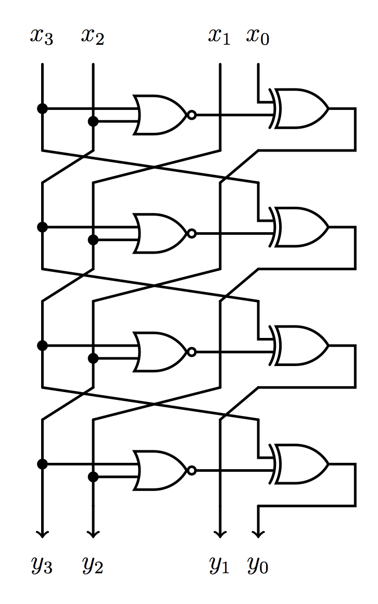

# FCSC 2020 Sbox

On vous demande d’évaluer le circuit donné (sbox.png) sur la valeur binaire de 4 bits (x3, x2, x1, x0) = (1, 0, 1, 0) pour trouver la valeur de y = (y3, y2, y1, y0) à la sortie du circuit. Le flag est FCSC{<y>}, avec <y> la valeur de sortie en écriture binaire sur 4 bits.

Exemple : sur l’entrée de 4 bits (x3, x2, x1, x0) = (1, 0, 0, 0), la valeur de sortie serait (y3, y2, y1, y0) = (0, 0, 1, 1) et flag serait FCSC{0011}.

Auteur : [Cryptanalyse](https://twitter.com/Cryptanalyse)

Origine : [Sbox](https://hackropole.fr/fr/challenges/hardware/fcsc2020-hardware-sbox/)

-----------

## Installation manuel
Vous n'utilisez pas l'application **les CTFs de Cyrhades** ? C'est dommage !
Mais voici comment installer ce CTF manuellement :

> git clone https://github.com/Hack-Oeil/fcsc2020-hardware-sbox.git

> cd fcsc2020-hardware-sbox

-----------

## Sur le site officiel hackropole.fr
> https://hackropole.fr/fr/challenges/hardware/fcsc2020-hardware-sbox/